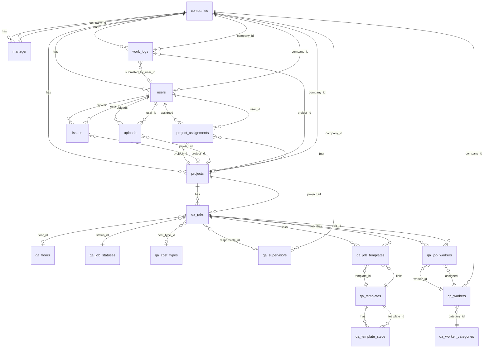

# 2. Documentație bazei de date

## ERD (Entity Relationship Diagram)

Diagramă Mermaid pentru relațiile principale. Tabelele sunt grupate pe domeniu.



### Relații sumar

| Relație | Tip | Descriere |
|--------|-----|------------|
| companies → manager | 1:N | O companie are mai mulți manageri |
| companies → users | 1:N | Operativi/supervizori per companie |
| companies → projects | 1:N | Proiecte per companie |
| projects ↔ users (project_assignments) | N:M | Utilizatori asignați la proiecte |
| projects → qa_jobs | 1:N | Joburi QA per proiect |
| qa_templates ↔ qa_jobs (qa_job_templates) | N:M | Template-uri aplicate la joburi |
| qa_jobs ↔ qa_workers (qa_job_workers) | N:M | Workers asignați la joburi |
| work_logs → company, user, project | N:1 | Work log aparține companiei; optional submitted_by, project |

---

## Schema tabelelor

### Chei primare / străine

- **PK**: toate tabelele au `id SERIAL PRIMARY KEY`, exceptând tabelele de legătură care pot avea PK compus sau surrogate.
- **FK**: unde este cazul, coloanele `company_id`, `project_id`, `user_id`, `manager_id` etc. se referă la tabelele corespunzătoare. Unele tabele nu au FK declarat în scripturi (ex. `manager.company_id` → `companies.id`) dar relația este logică.

---

### Tabel: companies

| Câmp | Tip | Restricții | Default |
|------|-----|------------|---------|
| id | SERIAL | PRIMARY KEY | auto |
| name | VARCHAR(255) | | |
| industry_type | VARCHAR(255) | | |
| subscription_plan | VARCHAR(255) | | |
| active | VARCHAR(50) | | 'not_active' |
| created_at | TIMESTAMP | | NOW() |
| created_by | VARCHAR(255) | | |
| security_question1 | VARCHAR(255) | | |
| security_token1 | VARCHAR(255) | | |
| office_address | VARCHAR(500) | | |

---

### Tabel: manager

| Câmp | Tip | Restricții | Default |
|------|-----|------------|---------|
| id | SERIAL | PRIMARY KEY | auto |
| company_id | INT | NOT NULL | |
| name | VARCHAR(255) | | |
| surname | VARCHAR(255) | | |
| email | VARCHAR(255) | | |
| password | VARCHAR(255) | | |
| active | BOOLEAN | | FALSE |
| created_at | TIMESTAMP | | NOW() |
| project_onboard_name | VARCHAR(255) | | |
| is_head_manager | VARCHAR(50) | | 'No' |
| active_status | BOOLEAN | | |
| dezactivation_date | TIME | | |

---

### Tabel: users (operativi / supervizori)

| Câmp | Tip | Restricții | Default |
|------|-----|------------|---------|
| id | SERIAL | PRIMARY KEY | auto |
| company_id | INT | NOT NULL | |
| project_id | INT | | |
| role | VARCHAR(100) | | |
| name | VARCHAR(500) | | |
| email | VARCHAR(255) | NOT NULL | UNIQUE(email, company_id) |
| password | VARCHAR(255) | | |
| active | BOOLEAN | | FALSE |
| created_at | TIMESTAMP | | NOW() |
| active_status | BOOLEAN | | FALSE |

**Indexuri**: idx_users_company_id, idx_users_email, idx_users_project_id.

---

### Tabel: projects

| Câmp | Tip | Restricții | Default |
|------|-----|------------|---------|
| id | SERIAL | PRIMARY KEY | auto |
| company_id | INT | NOT NULL | |
| name | VARCHAR(255) | | |
| address | VARCHAR(500) | | |
| start_date | DATE | | |
| description | TEXT | | |
| created_at | TIMESTAMP | | NOW() |

**Indexuri**: idx_projects_company_id.  
*Notă: pot exista migrări care adaugă project_name, planned_end_date, number_of_floors, active.*

---

### Tabel: project_assignments

| Câmp | Tip | Restricții | Default |
|------|-----|------------|---------|
| id | SERIAL | PRIMARY KEY | auto |
| project_id | INT | NOT NULL | |
| user_id | INT | NOT NULL | UNIQUE(project_id, user_id) |
| role | VARCHAR(100) | | |
| assigned_at | TIMESTAMP | | NOW() |

**Indexuri**: idx_project_assignments_project, idx_project_assignments_user.

---

### Tabel: work_logs

| Câmp | Tip | Restricții | Default |
|------|-----|------------|---------|
| id | SERIAL | PRIMARY KEY | auto |
| company_id | INT | NOT NULL | |
| submitted_by_user_id | INT | | |
| project_id | INT | | |
| job_display_id | VARCHAR(50) | NOT NULL | UNIQUE(company_id, job_display_id) |
| worker_name | VARCHAR(255) | NOT NULL | |
| project, block, floor, apartment, zone | VARCHAR | | |
| work_type | VARCHAR(255) | | |
| quantity | NUMERIC(12,2) | | |
| unit_price | NUMERIC(12,2) | | |
| total | NUMERIC(12,2) | | |
| status | VARCHAR(50) | NOT NULL | 'pending' |
| description | TEXT | | |
| submitted_at | TIMESTAMPTZ | | NOW() |
| work_was_edited | BOOLEAN | | FALSE |
| edit_history | JSONB | | '[]' |
| photo_urls | JSONB | | '[]' |
| invoice_file_path | VARCHAR(500) | | |
| archived | BOOLEAN | | FALSE |
| created_at, updated_at | TIMESTAMPTZ | | NOW() |

**Indexuri**: company_id, submitted_by_user_id, status, submitted_at, archived, (company_id, job_display_id).

---

### Tabele QA (Quality Assurance)

- **qa_worker_categories**: id, code (UNIQUE), label.
- **qa_cost_types**: id, code (UNIQUE), label.
- **qa_job_statuses**: id, code (UNIQUE), label.
- **qa_floors**: id, project_id (FK projects, nullable), code, label, sort_order.
- **qa_supervisors**: id, company_id, name.
- **qa_workers**: id, company_id, name, category_id (FK qa_worker_categories).
- **qa_templates**: id, name, created_at, created_by, updated_at, updated_by.
- **qa_template_steps**: id, template_id (FK), sort_order, description, price_per_m2, price_per_unit, price_per_linear, step_external_id.
- **qa_jobs**: id, project_id (FK), job_number, floor_id, floor_code, location, sqm, linear_meters, specification, description, target_completion_date, cost_included, cost_type_id, cost_value, responsible_id, status_id (FK), created_by, updated_at, updated_by. UNIQUE(project_id, job_number).
- **qa_job_templates**: job_id (FK), template_id (FK). UNIQUE(job_id, template_id).
- **qa_job_workers**: job_id (FK), worker_id (FK). UNIQUE(job_id, worker_id).

---

### Tabele issues și uploads

- **issues**: id, user_id, project_id, title, description, file_url, created_at.
- **uploads**: id, user_id, project_id, file_url, description, created_at.

---

## Scripturi de creare și seed

### Ordinea recomandată de rulare

1. **Companii și manager**: `create_companies_table.sql` → `create_manager_table.sql`
2. **Utilizatori și proiecte**: `create_users_table.sql` → `create_projects_table.sql` sau `setup_projects_and_assignments.sql` (include project_assignments și alter users.project_id)
3. **Work logs**: `create_work_logs_table.sql`; opțional `seed_work_logs.sql` pentru date de test
4. **QA**: `setup_qa_database.sql` (include companies, projects dacă nu există, toate tabelele QA + seed lookup); sau `create_qa_tables.sql` + `seed_qa_lookup.sql`
5. **Alte tabele**: `create_issues_table.sql`, `create_uploads_table.sql`, `create_tasks_table.sql`, `create_work_hours_table.sql` conform nevoilor

### Comenzi exemplu

```bash
# Conectare la baza ProconixDB
psql -U postgres -d ProconixDB -f scripts/create_companies_table.sql
psql -U postgres -d ProconixDB -f scripts/create_manager_table.sql
psql -U postgres -d ProconixDB -f scripts/create_users_table.sql
psql -U postgres -d ProconixDB -f scripts/setup_projects_and_assignments.sql
psql -U postgres -d ProconixDB -f scripts/create_work_logs_table.sql
psql -U postgres -d ProconixDB -f scripts/setup_qa_database.sql
```

### Insert-uri de test (seed)

- **QA**: `seed_qa_lookup.sql` – categorii workers, cost types, job statuses, etaje globale.
- **Work logs**: `seed_work_logs.sql` – dacă există, pentru populare inițială.

---

*Păstrează documentația actualizată la fiecare schimbare de schemă sau script nou.*
