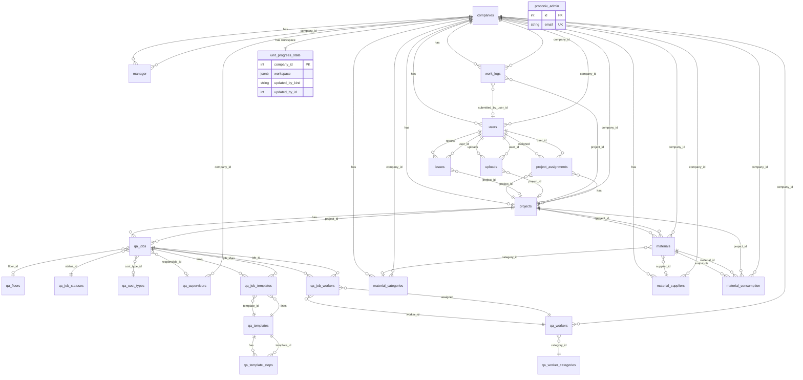

# 2. Documentație bazei de date

## ERD (Entity Relationship Diagram)

Diagramă Mermaid pentru relațiile principale. Tabelele sunt grupate pe domeniu.


```mermaid
erDiagram
  companies ||--o{ manager : "has"
  companies ||--o{ users : "has"
  companies ||--o{ projects : "has"
  companies ||--o{ work_logs : "has"
  companies ||--|| unit_progress_state : "has workspace"

  manager }o--|| companies : "company_id"
  users }o--|| companies : "company_id"
  projects }o--|| companies : "company_id"
  work_logs }o--|| companies : "company_id"

  projects ||--o{ project_assignments : "has"
  users ||--o{ project_assignments : "assigned"
  project_assignments }o--|| projects : "project_id"
  project_assignments }o--|| users : "user_id"

  projects ||--o{ qa_jobs : "has"
  qa_jobs }o--|| projects : "project_id"
  qa_jobs }o--o| qa_floors : "floor_id"
  qa_jobs }o--|| qa_job_statuses : "status_id"
  qa_jobs }o--o| qa_cost_types : "cost_type_id"
  qa_jobs }o--o| qa_supervisors : "responsible_id"

  qa_templates ||--o{ qa_template_steps : "has"
  qa_template_steps }o--|| qa_templates : "template_id"

  qa_jobs ||--o{ qa_job_templates : "links"
  qa_templates ||--o{ qa_job_templates : "links"
  qa_job_templates }o--|| qa_jobs : "job_id"
  qa_job_templates }o--|| qa_templates : "template_id"

  qa_jobs ||--o{ qa_job_workers : "has"
  qa_workers ||--o{ qa_job_workers : "assigned"
  qa_job_workers }o--|| qa_jobs : "job_id"
  qa_job_workers }o--|| qa_workers : "worker_id"

  qa_workers }o--|| qa_worker_categories : "category_id"
  qa_supervisors }o--|| companies : "company_id"
  qa_workers }o--|| companies : "company_id"

  users ||--o{ issues : "reports"
  issues }o--|| users : "user_id"
  issues }o--o| projects : "project_id"

  users ||--o{ uploads : "uploads"
  uploads }o--|| users : "user_id"
  uploads }o--o| projects : "project_id"

  work_logs }o--o| users : "submitted_by_user_id"
  work_logs }o--o| projects : "project_id"

  companies ||--o{ material_categories : "has"
  companies ||--o{ material_suppliers : "has"
  material_categories }o--|| companies : "company_id"
  material_suppliers }o--|| companies : "company_id"

  projects ||--o{ materials : "has"
  materials }o--|| projects : "project_id"
  materials }o--|| companies : "company_id"
  materials }o--o| material_categories : "category_id"
  materials }o--o| material_suppliers : "supplier_id"

  materials ||--o{ material_consumption : "snapshots"
  material_consumption }o--|| materials : "material_id"
  material_consumption }o--|| projects : "project_id"
  material_consumption }o--|| companies : "company_id"

  proconix_admin {
    int id PK
    string email UK
  }

  unit_progress_state {
    int company_id PK
    jsonb workspace
    string updated_by_kind
    int updated_by_id
  }
```

### Relații sumar

| Relație | Tip | Descriere |
|--------|-----|------------|
| companies → manager | 1:N | O companie are mai mulți manageri |
| companies → users | 1:N | Operativi/supervizori per companie |
| companies → projects | 1:N | Proiecte per companie |
| companies → unit_progress_state | 1:1 | Workspace Unit Progress per companie (JSONB) |
| projects ↔ users (project_assignments) | N:M | Utilizatori asignați la proiecte |
| projects → qa_jobs | 1:N | Joburi QA per proiect |
| qa_templates ↔ qa_jobs (qa_job_templates) | N:M | Template-uri aplicate la joburi |
| qa_jobs ↔ qa_workers (qa_job_workers) | N:M | Workers asignați la joburi |
| work_logs → company, user, project | N:1 | Work log aparține companiei; optional submitted_by, project |
| companies → material_categories, material_suppliers | 1:N | Categorii și furnizori per companie |
| projects → materials | 1:N | Materiale (stoc) per proiect; material are category_id, supplier_id opțional |
| materials → material_consumption | 1:N | Snapshot zilnic quantity_remaining per material (pentru forecast) |

---

## Schema tabelelor

### Chei primare / străine

- **PK**: toate tabelele au `id SERIAL PRIMARY KEY`, exceptând tabelele de legătură care pot avea PK compus sau surrogate.
- **FK**: unde este cazul, coloanele `company_id`, `project_id`, `user_id`, `manager_id` etc. se referă la tabelele corespunzătoare. Unele tabele nu au FK declarat în scripturi (ex. `manager.company_id` → `companies.id`) dar relația este logică.

---

### Tabel: companies

| Câmp | Tip | Restricții | Default |
|------|-----|------------|---------|
| id | SERIAL | PRIMARY KEY | auto |
| name | VARCHAR(255) | | |
| industry_type | VARCHAR(255) | | |
| subscription_plan | VARCHAR(255) | | |
| active | VARCHAR(50) | | 'not_active' |
| created_at | TIMESTAMP | | NOW() |
| created_by | VARCHAR(255) | | |
| security_question1 | VARCHAR(255) | | |
| security_token1 | VARCHAR(255) | | |
| office_address | VARCHAR(500) | | |
| plan_purchased_at | TIMESTAMPTZ | opțional | — |
| plan_expires_at | TIMESTAMPTZ | opțional | — |
| payment_method | VARCHAR(80) | opțional | — |
| billing_status | VARCHAR(40) | opțional | `paid_active` / `unpaid_suspended` / `unpaid_active` (admin Billing) |

*Migrare: `scripts/alter_companies_billing_columns.sql` (+ opțional `alter_companies_billing_status.sql`). Înregistrare: `billingPlanDefaults` + `billing_status` implicit `unpaid_active`.*

---

### Tabel: manager

| Câmp | Tip | Restricții | Default |
|------|-----|------------|---------|
| id | SERIAL | PRIMARY KEY | auto |
| company_id | INT | NOT NULL | |
| name | VARCHAR(255) | | |
| surname | VARCHAR(255) | | |
| email | VARCHAR(255) | | |
| password | VARCHAR(255) | | |
| active | BOOLEAN | | FALSE |
| created_at | TIMESTAMP | | NOW() |
| project_onboard_name | VARCHAR(255) | | |
| is_head_manager | VARCHAR(50) | | 'No' |
| active_status | BOOLEAN | | |
| dezactivation_date | TIME | | |
| phone | VARCHAR(50) | opțional | — |

*Notă: coloana `phone` poate lipsi în deploy-uri vechi; API-ul `GET /api/managers/me` raportează `phone_supported: false` și `PATCH /api/managers/phone` returnează 400 până la migrare (ALTER TABLE manager ADD COLUMN phone …).*

---

### Tabel: users (operativi / supervizori)

| Câmp | Tip | Restricții | Default |
|------|-----|------------|---------|
| id | SERIAL | PRIMARY KEY | auto |
| company_id | INT | NOT NULL | |
| project_id | INT | | |
| role | VARCHAR(100) | | |
| name | VARCHAR(500) | | |
| email | VARCHAR(255) | NOT NULL | UNIQUE(email, company_id) |
| password | VARCHAR(255) | | |
| active | BOOLEAN | | FALSE |
| created_at | TIMESTAMP | | NOW() |
| active_status | BOOLEAN | | FALSE |

**Indexuri**: idx_users_company_id, idx_users_email, idx_users_project_id.

---

### Tabel: projects

| Câmp | Tip | Restricții | Default |
|------|-----|------------|---------|
| id | SERIAL | PRIMARY KEY | auto |
| company_id | INT | NOT NULL | |
| name / project_name | VARCHAR(255) | | |
| address | VARCHAR(500) | | |
| start_date | DATE | | |
| planned_end_date | DATE | | |
| number_of_floors | INT | | |
| description | TEXT | | |
| latitude | NUMERIC(9,6) | | |
| longitude | NUMERIC(9,6) | | |
| active | BOOLEAN | | TRUE |
| created_at | TIMESTAMP | | NOW() |

**Indexuri**: idx_projects_company_id.  
*Notă: migrarea `scripts/alter_projects_add_location.sql` adaugă coloanele `latitude` și `longitude` (geolocația proiectului).*

---

### Tabel: project_assignments

| Câmp | Tip | Restricții | Default |
|------|-----|------------|---------|
| id | SERIAL | PRIMARY KEY | auto |
| project_id | INT | NOT NULL | |
| user_id | INT | NOT NULL | UNIQUE(project_id, user_id) |
| role | VARCHAR(100) | | |
| assigned_at | TIMESTAMP | | NOW() |

**Indexuri**: idx_project_assignments_project, idx_project_assignments_user.

---

### Tabel: work_logs

| Câmp | Tip | Restricții | Default |
|------|-----|------------|---------|
| id | SERIAL | PRIMARY KEY | auto |
| company_id | INT | NOT NULL | |
| submitted_by_user_id | INT | | |
| project_id | INT | | |
| job_display_id | VARCHAR(50) | NOT NULL | UNIQUE(company_id, job_display_id) |
| worker_name | VARCHAR(255) | NOT NULL | |
| project, block, floor, apartment, zone | VARCHAR | | |
| work_type | VARCHAR(255) | | |
| quantity | NUMERIC(12,2) | | |
| unit_price | NUMERIC(12,2) | | |
| total | NUMERIC(12,2) | | |
| status | VARCHAR(50) | NOT NULL | 'pending' |
| description | TEXT | | |
| submitted_at | TIMESTAMPTZ | | NOW() |
| work_was_edited | BOOLEAN | | FALSE |
| edit_history | JSONB | | '[]' |
| photo_urls | JSONB | | '[]' |
| timesheet_jobs | JSONB | opțional (migrare) | '[]' — joburi pontaj structurate: `location`, `description`, `duration`, `duration_unit`, `stage`, `progress_pct`, **`photos`** (array de URL-uri `/uploads/...`) |
| invoice_file_path | VARCHAR(500) | | |
| operative_archived | BOOLEAN | opțional (migrare) | FALSE — ascunde intrarea în dashboard operativ; manager vede în continuare |
| operative_archived_at | TIMESTAMPTZ | opțional | setat la arhivare operativ |
| archived | BOOLEAN | | FALSE — arhivare manager (Work Logs) |
| created_at, updated_at | TIMESTAMPTZ | | NOW() |

**Indexuri**: company_id, submitted_by_user_id, status, submitted_at, archived, **operative_archived** (dacă există coloana), (company_id, job_display_id).

**Migrări**: `scripts/alter_work_logs_add_timesheet_jobs.sql`, `scripts/alter_work_logs_add_operative_archived.sql`. Coloanele sunt incluse și în `scripts/create_work_logs_table.sql` pentru baze noi.

---

### Tabele QA (Quality Assurance)

- **qa_worker_categories**: id, code (UNIQUE), label.
- **qa_cost_types**: id, code (UNIQUE), label.
- **qa_job_statuses**: id, code (UNIQUE), label.
- **qa_floors**: id, project_id (FK projects, nullable), code, label, sort_order.
- **qa_supervisors**: id, company_id, name.
- **qa_workers**: id, company_id, name, category_id (FK qa_worker_categories).
- **qa_templates**: id, name, created_at, created_by, updated_at, updated_by.
- **qa_template_steps**: id, template_id (FK), sort_order, description, price_per_m2, price_per_unit, price_per_linear, step_external_id.
- **qa_jobs**: id, project_id (FK), job_number, floor_id, floor_code, location, sqm, linear_meters, specification, description, target_completion_date, cost_included, cost_type_id, cost_value, responsible_id, status_id (FK), created_by, updated_at, updated_by. UNIQUE(project_id, job_number).
- **qa_job_templates**: job_id (FK), template_id (FK). UNIQUE(job_id, template_id).
- **qa_job_workers**: job_id (FK), worker_id (FK). UNIQUE(job_id, worker_id).

---

### Tabele Material Management

- **material_categories**: id, company_id, name, description, created_at, created_by_id, created_by_name, updated_at, updated_by_id, updated_by_name, deleted_at, deleted_by_id, deleted_by_name. Index: company_id, (company_id, deleted_at).
- **material_suppliers**: id, company_id, name, contact, email_phone, address, created_at, created_by_id, created_by_name, updated_at, updated_by_id, updated_by_name, deleted_at, deleted_by_id, deleted_by_name. Index: company_id, (company_id, deleted_at).
- **materials**: id, project_id, company_id, name, category_id (FK), supplier_id (FK), unit, quantity_initial, quantity_used, quantity_remaining, low_stock_threshold, status ('normal'|'low'|'out'), email_notify, created_at, created_by_id, created_by_name, updated_at, updated_by_id, updated_by_name, deleted_at, deleted_by_id, deleted_by_name. FK: project_id→projects, category_id→material_categories, supplier_id→material_suppliers. Index: project_id, (project_id, deleted_at), (company_id, deleted_at).
- **material_consumption**: id, material_id (FK materials ON DELETE CASCADE), project_id, company_id, snapshot_date (DATE), quantity_remaining, recorded_at. UNIQUE(material_id, snapshot_date). Index: (project_id, snapshot_date), (company_id, snapshot_date). Folosit pentru calcul forecast (Usage last week / Forecast this week) din consum zilnic derivat.

### Tabele issues și uploads

- **issues**: id, user_id, project_id, title, description, file_url, created_at.
- **uploads**: id, user_id, project_id, file_url, description, created_at.

---
## Tabel: unit_progress_state (Unit Progress Tracking)

Workspace-ul complet pentru modulul Unit Progress este stocat pe companie, în JSONB.

| Câmp | Tip | Restricții | Default |
|------|-----|------------|---------|
| company_id | INT | PRIMARY KEY | — |
| workspace | JSONB | NOT NULL | `'{}'::jsonb` |
| updated_by_kind | VARCHAR(20) | | |
| updated_by_id | INT | | |
| updated_at | TIMESTAMPTZ | NOT NULL | NOW() |
| created_at | TIMESTAMPTZ | NOT NULL | NOW() |

Structura JSON `workspace` include de regulă `towers[]`, `floors[]`, `units[]`, `updated_at`. În `units[]`, fiecare unitate poate avea `project_id` și `timeline[]`.

Script: `scripts/create_unit_progress_tables.sql`.

---
## Tabele Planning (Task & Planning)

Modulul `Task & Planning` centralizează planurile și task-urile managerului.

### Tabel: planning_plans

| Câmp | Tip | Restricții |
|------|-----|------------|
| id | SERIAL | PRIMARY KEY |
| company_id | INT | NOT NULL |
| type | VARCHAR(20) | CHECK: `daily|weekly|monthly` |
| start_date | DATE | NOT NULL |
| end_date | DATE | NOT NULL |
| created_by | INT | poate fi NULL |
| created_at | TIMESTAMPTZ | DEFAULT NOW() |

### Tabel: planning_plan_tasks

| Câmp | Tip | Restricții / Default |
|------|-----|------------------------|
| id | SERIAL | PRIMARY KEY |
| plan_id | INT | FK → `planning_plans(id)` ON DELETE CASCADE |
| qa_job_id | INT | legătură QA ↔ Planning (AUTO: adăugat prin `scripts/alter_planning_add_qa_job_id.sql`) |
| title | VARCHAR(255) | NOT NULL |
| description | TEXT | poate fi NULL |
| assigned_to | TEXT[] | NOT NULL DEFAULT `'{}'` |
| priority | VARCHAR(20) | DEFAULT `'medium'`; CHECK: `low|medium|high|critical` |
| deadline | TIMESTAMPTZ | NOT NULL |
| pickup_start_date | DATE | NOT NULL |
| notes | TEXT | poate fi NULL |
| status | VARCHAR(20) | DEFAULT `'not_started'`; CHECK: `not_started|in_progress|paused|completed|declined` (vezi `operative_task_photos_and_declined.sql`) |
| send_to_assignees | BOOLEAN | DEFAULT `true` |
| created_at | TIMESTAMPTZ | DEFAULT NOW() |

### Scripturi asociate
- `scripts/create_planning_tables.sql` creează `planning_plans` și `planning_plan_tasks`.

**Poze confirmare (planning):** operativul încarcă imagini în `operative_task_photos` cu `task_source = 'planning'` și `task_id` = `planning_plan_tasks.id`. Managerul le poate lista din UI (Task & Planning, task **completed**) prin API `GET /api/planning/plan-tasks/:id/confirmation-photos`.

---

## Scripturi de creare și seed

### Tabel: work_hours (pontaj operativi)

| Câmp | Tip | Restricții | Default |
|------|-----|------------|---------|
| id | SERIAL | PRIMARY KEY | auto |
| user_id | INT | NOT NULL | |
| project_id | INT | | |
| clock_in | TIMESTAMPTZ | NOT NULL | NOW() |
| clock_out | TIMESTAMPTZ | | |
| clock_in_latitude | NUMERIC(9,6) | | |
| clock_in_longitude | NUMERIC(9,6) | | |
| clock_out_latitude | NUMERIC(9,6) | | |
| clock_out_longitude | NUMERIC(9,6) | | |

*Notă: `scripts/create_work_hours_table.sql` creează tabela de bază; `scripts/alter_work_hours_add_geolocation.sql` adaugă coloanele de geolocație pentru clock-in/out.*

---

### Tabel: `proconix_admin`

Administratori **platformă** Proconix (nu manageri de companie). Autentificare separată de `manager` / `users`.

| Câmp | Tip | Note |
|------|-----|------|
| id | SERIAL | PK |
| full_name | VARCHAR(255) | |
| email | VARCHAR(255) | UNIQUE |
| password_hash | VARCHAR(255) | bcrypt (cost 10), ca la `manager` |
| address | TEXT | |
| enroll_date | DATE | data înrolare |
| admin_rank | VARCHAR(50) | ex. `admin` |
| access_level | VARCHAR(80) | ex. `full_acces` (valoare business / seed) |
| active | BOOLEAN | DEFAULT TRUE |
| created_at, updated_at | TIMESTAMPTZ | |

- Script: `scripts/create_proconix_admin_table.sql` (CREATE + seed inițial pentru contul configurat acolo).
- **Securitate:** nu stoca parola în clar; schimbă parola după primul login în producție.

---

### Ordinea recomandată de rulare

1. **Companii și manager**: `create_companies_table.sql` → `create_manager_table.sql`
2. **Utilizatori și proiecte**: `create_users_table.sql` → `create_projects_table.sql` sau `setup_projects_and_assignments.sql` (include project_assignments și alter users.project_id)
3. **Work logs**: `create_work_logs_table.sql`; opțional `seed_work_logs.sql` pentru date de test
4. **QA**: `setup_qa_database.sql` (include companies, projects dacă nu există, toate tabelele QA + seed lookup); sau `create_qa_tables.sql` + `seed_qa_lookup.sql`
5. **Planning (Task & Planning)**: `scripts/create_planning_tables.sql`
6. **QA ↔ Planning linkage**: `scripts/alter_planning_add_qa_job_id.sql`
7. **Material Management**: `create_material_tables.sql` (material_categories, material_suppliers, materials); apoi `create_material_consumption_table.sql` (snapshot zilnic pentru forecast)
8. **Pontaj & geolocație**: `create_work_hours_table.sql` → `alter_work_hours_add_geolocation.sql`
9. **Operativ – task confirmări**: `operative_task_photos_and_declined.sql` – tabel `operative_task_photos` (poze confirmare per user/task, max 10 în API); extinde status planning cu `declined` (refuz operativ)
10. **Alte tabele**: `create_issues_table.sql`, `create_uploads_table.sql`, `create_tasks_table.sql`, `alter_projects_add_location.sql` (dacă nu a fost rulat deja) conform nevoilor
11. **Admin platformă Proconix**: `scripts/create_proconix_admin_table.sql` (`proconix_admin` + seed)
12. **Unit Progress Tracking**: `scripts/create_unit_progress_tables.sql`

### Comenzi exemplu

```bash
# Conectare la baza ProconixDB
psql -U postgres -d ProconixDB -f scripts/create_companies_table.sql
psql -U postgres -d ProconixDB -f scripts/create_manager_table.sql
psql -U postgres -d ProconixDB -f scripts/create_users_table.sql
psql -U postgres -d ProconixDB -f scripts/setup_projects_and_assignments.sql
psql -U postgres -d ProconixDB -f scripts/create_work_logs_table.sql
psql -U postgres -d ProconixDB -f scripts/setup_qa_database.sql
psql -U postgres -d ProconixDB -f scripts/create_planning_tables.sql
psql -U postgres -d ProconixDB -f scripts/alter_planning_add_qa_job_id.sql
psql -U postgres -d ProconixDB -f scripts/create_material_tables.sql
psql -U postgres -d ProconixDB -f scripts/create_material_consumption_table.sql
psql -U postgres -d ProconixDB -f scripts/create_proconix_admin_table.sql
psql -U postgres -d ProconixDB -f scripts/create_unit_progress_tables.sql
psql -U postgres -d ProconixDB -f scripts/create_work_hours_table.sql
psql -U postgres -d ProconixDB -f scripts/alter_work_hours_add_geolocation.sql
psql -U postgres -d ProconixDB -f scripts/alter_projects_add_location.sql
```

### Insert-uri de test (seed)

- **QA**: `seed_qa_lookup.sql` – categorii workers, cost types, job statuses, etaje globale.
- **Work logs**: `seed_work_logs.sql` – dacă există, pentru populare inițială.

---

*Păstrează documentația actualizată la fiecare schimbare de schemă sau script nou.*

**Actualizat:** 26/04/2026
