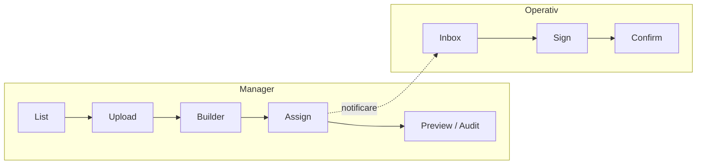

# Plan complet de dezvoltare front-end — Documente & Semnături digitale (Proconix)

Document destinat echipei front-end. Backend-ul este presupus a expune API-urile listate; integrarea reală se face când contractele sunt disponibile.

---

## 0. Context stack Proconix (repo actual)

În acest repository, front-end-ul principal este **HTML + CSS + JavaScript (vanilla)**, cu **Bootstrap 5**, fără React în `package.json`. Dashboard-ul manager (`dashboard_manager.html` + `dashboard.js`) încarcă module dinamic sau prin **iframe** (ex.: QA, Planning, Materials).

**Două căi de implementare (alegere product / arhitectură):**

| Abordare | Când are sens | Livrabile |
|----------|---------------|-----------|
| **A — Consistent cu repo** | Continuitate rapidă, fără build step nou | Pagini `documents_manager.html` / `documents_signing.html`, `css/documents.css`, `js/documents_manager.js`, `js/documents_operative.js`; integrare în `dashboardRoutes.js` + link în sidebar |
| **B — SPA React** (conform specificației) | Produs complex (builder drag-drop, state mare) | Sub-proiect `frontend/documents-app/` (Vite + React) sau monorepo; embed în iframe din dashboard sau rute separate |

Planul de mai jos este **agnostic**: componentele și state-ul se mapează 1:1 la **module ES / clase** (A) sau la **componente React** (B).

---

## 1. Structura generală a modulului (4 secțiuni)

| Secțiune | Rol | Public țintă |
|----------|-----|--------------|
| **1. Document List View** | Listă, filtre, status, acțiuni bulk | Manager |
| **2. Document Builder (Drag & Drop)** | Upload PDF, plasare câmpuri (semnătură, checkbox, dată, nume) | Manager |
| **3. Document Assignment** | Selectare operativi, deadline, repetitivitate, obligatoriu | Manager |
| **4. Document Signing Flow** | Vizualizare PDF, semnătură tactilă, confirmare | Operativ |

Flux recomandat manager: **List → Create/Upload → Builder → Assignment → Preview/Audit**.  
Flux operativ: **Incoming list → Signing screen → Confirmation**.

---

## 2. Cerințe tehnice

### 2.1 Stack recomandat (varianta B — React)

- **Framework:** React 18+ (Next.js doar dacă produsul adoptă SSR pentru acest modul; altfel Vite + React e suficient).
- **State:** Zustand (mai simplu pentru prototip) sau Redux Toolkit (dacă există deja standard în organizație).
- **Styling:** Tailwind CSS **sau** MUI — **obligatoriu** aliniere la variabilele de temă Proconix (`dashboard_manager.css`: fundal închis, accent cyan, carduri). Dacă MUI: `createTheme` cu palette mapată la brand.
- **PDF:** `@react-pdf/renderer` pentru generare opțională; pentru **afișare** PDF-uri existente: `react-pdf` (`pdfjs-dist`) — documentație oficială cere worker CDN sau path local.
- **Drag & Drop:** `@dnd-kit/core` + `@dnd-kit/sortable` (recomandat) sau `react-draggable` pentru câmpuri simple pe canvas.
- **Semnătură:** `react-signature-canvas` (export PNG base64 sau blob).
- **Date:** `react-datepicker` sau `@mui/x-date-pickers`.
- **HTTP:** `fetch` cu wrapper mic (retry + error shape) sau TanStack Query pentru cache + loading states.

### 2.2 Stack alternativ (varianta A — vanilla)

- PDF.js pentru canvas; semnătură: `<canvas>` + evenimente touch/pointer sau mică bibliotecă signature_pad.
- Drag: `interact.js` sau poziționare manuală cu pointer events.
- Fără bundler: script-uri în `frontend/js/`, stiluri în `frontend/css/documents.css`.

### 2.3 Biblioteci — rezumat

| Nevoie | Bibliotecă |
|--------|------------|
| Randare PDF | `react-pdf` + `pdfjs-dist` |
| Plasare câmpuri | `@dnd-kit/*` |
| Semnătură | `react-signature-canvas` |
| Date | `react-datepicker` / MUI DatePicker |
| UI | MUI sau Tailwind + componente proprii |

---

## 3. Pagini și componente (manager)

### 3.1 Document List Page

**Componente:**

| Componentă | Responsabilitate |
|------------|------------------|
| `DocumentCard` | Titlu, tip document, proiect, snippet deadline, progres semnături (ex. `7/10`), acțiuni (Edit template, Assign, View audit, Delete) |
| `StatusBadge` | Stări: `draft`, `pending_signatures`, `completed`, `expired`, `cancelled` — culori: verde / galben / roșu / gri |
| `Filters` | Proiect (select), Tip document (select), Status (multi sau single) |
| `SearchBar` | Căutare text în titlu/descriere |
| `PrimaryButton` | „Create New Document” → deschide modal upload sau navigare la wizard |

**Funcționalitate:**

- Încărcare listă: `GET /documents/list` (query: projectId, type, status, q, sort, page).
- Sortare: dată creare, dată deadline, nume proiect, tip (din UI → query params).
- Empty state + skeleton rows la încărcare.

### 3.2 Document Upload Modal (wizard pas 1)

**Componente:**

| Componentă | Responsabilitate |
|------------|------------------|
| `FileUploader` | drag-drop + input file, accept `.pdf`, max size (ex. 10–25 MB), mesaj eroare |
| `TextInputs` | Nume document (required), descriere (optional) |
| `DocumentTypeSelect` | RAMS, Toolbox Talk, Induction, Other (valorile exacte din contract API) |
| `ContinueButton` | Validează → trece la Builder sau `POST /documents/upload` |

**Funcționalitate:**

- După upload reușit: răspuns conține `documentId` + URL fișier pentru builder.
- Validare client: fișier PDF, nume non-gol.

### 3.3 Document Builder (Drag & Drop Editor)

**Componente:**

| Componentă | Responsabilitate |
|------------|------------------|
| `PDFViewer` | Paginare PDF, zoom, scroll sincron cu overlay |
| `BuilderSidebar` | Listează tipuri de câmp: Signature, Checkbox, Date, Name (auto) |
| `FieldOverlay` | Câmp plasat pe pagină: poziție, dimensiune, id unic, pagină index |
| `CanvasLayer` | Z-index peste PDF; coordonate relative la container sau la pagină PDF |
| `SaveTemplateButton` | `POST /documents/{id}/fields` cu array de field-uri |

**Model câmp (exemplu JSON):**

```json
{
  "id": "uuid",
  "type": "signature|checkbox|date|name",
  "page": 1,
  "x": 0.12,
  "y": 0.45,
  "width": 0.35,
  "height": 0.08,
  "label": "Sign here",
  "required": true
}
```

Recomandare: coordonate **normalizate 0–1** față de lățime/înălțime pagină pentru resize responsive.

**Funcționalitate:**

- Minim **1** câmp de tip `signature` înainte de Save (validare).
- Redimensionare: colțuri drag; ștergere câmp; undo local (opțional).

### 3.4 Assignment Screen

**Componente:**

| Componentă | Responsabilitate |
|------------|------------------|
| `UserSelectionList` | Checkbox per operativ; filtru după proiect/rol |
| `ProjectSelector` | Dacă documentul e legat de proiect (pre-fill din document) |
| `DeadlinePicker` | Dată + opțional oră |
| `ToggleMandatory` | „Document obligatoriu” |
| `ToggleRecurrence` | „Repetă la X zile” + input numeric X |
| `AssignButton` | `POST /documents/{id}/assign` |

**Funcționalitate:**

- Minim 1 utilizator selectat.
- Deadline valid (>= azi, sau conform regulii business).
- Loading + toast succes/eroare; notificările sunt responsabilitate backend — UI afișează confirmare API.

### 3.5 Document Preview + Audit Panel

**Componente:**

| Componentă | Responsabilitate |
|------------|------------------|
| `PDFViewer` | Versiune finală sau draft cu overlay semnături aplicate (dacă API livrează PNG poziții) |
| `SignatureTimeline` | Listă: nume, rol, dată/oră, status |
| `GPSMap` | Opțional — doar dacă `GET /documents/{id}/audit` returnează coordonate |
| `ExportPdfButton` | `GET` sau `POST` export — link temporar |
| `ShareLinkButton` | Copiere link semnare (dacă există flow „magic link”) |

---

## 4. Interfață operativ (flow semnare)

### 4.1 Incoming Documents View

- Listă documente adresate userului: `GET /documents/list?role=signer` sau endpoint dedicat `GET /documents/inbox`.
- `ListItem`: status (New / Pending / Urgent), badge deadline, buton **View**.

### 4.2 Document Signing Screen

**Componente:**

| Componentă | Responsabilitate |
|------------|------------------|
| `PDFViewer` full-screen (mobile-first) | Scroll + zoom control mare |
| `AddSignatureButton` | Deschide modal |
| `SignaturePadModal` | `react-signature-canvas`, clear, confirm |
| `ReadConfirmCheckbox` | „Confirm că am citit documentul” (obligatoriu) |
| `SubmitButton` | Dezactivat până la semnătură + checkbox; `POST /documents/{id}/sign` |

**Payload semnare (exemplu):**

```json
{
  "signatureImageBase64": "data:image/png;base64,...",
  "fieldId": "uuid",
  "confirmedRead": true,
  "clientMeta": { "userAgent": "...", "submittedAt": "ISO-8601" }
}
```

### 4.3 Confirmation Screen

- Animație success (CSS sau Lottie).
- Text: „Ai semnat cu succes” / „Document submitted”.
- Buton: **Back to Dashboard** (link către `operative_dashboard.html` sau rută SPA).

---

## 5. State management + flux API

### 5.1 State-uri cheie (Zustand / Redux / modul vanilla)

| Cheie | Conținut |
|-------|----------|
| `documentsList` | Paginare, filtre, items[], total, loading, error |
| `currentDocument` | Metadata document activ (id, nume, status, projectId) |
| `currentPdfUrl` | URL blob sau signed URL de la upload |
| `fieldsOnDocument` | Array câmpuri builder + selecție câmp activ |
| `assignment` | userIds[], deadline, mandatory, recurrenceDays |
| `signing` | semnătură PNG, checkbox confirm, loading submit |
| `audit` | timeline evenimente pentru panel audit |

### 5.2 Endpoint-uri (contract front-end)

| Metodă | Endpoint | Rol |
|--------|----------|-----|
| POST | `/documents/upload` | Upload PDF + meta |
| POST | `/documents/{id}/fields` | Salvează template câmpuri |
| POST | `/documents/{id}/assign` | Asignare operativi + deadline + opțiuni |
| GET | `/documents/list` | Listă + filtre |
| GET | `/documents/{id}` | Detaliu document + URL PDF |
| POST | `/documents/{id}/sign` | Trimite semnătură + confirmări |
| GET | `/documents/{id}/audit` | Audit trail |
| GET | `/users/list` sau `/api/operatives` | Listă pentru assignment (aliniat la API existent Proconix) |

**Note:** Prefixul real poate fi `/api/documents/...`; front-end păstrează constantă `API_BASE`.

---

## 6. Validări (client)

| Etapă | Reguli |
|-------|--------|
| Creare / upload | Nume obligatoriu; fișier PDF obligatoriu; tip document selectat |
| Builder | Minim 1 câmp `signature`; toate câmpurile required au label sau poziție validă |
| Assignment | Minim 1 user; deadline valid (format + comparare cu azi) |
| Semnare | Semnătură nevidă (canvas); checkbox „am citit” bifat; opțional: verificare online (`navigator.onLine`) înainte de submit |

Mesaje de eroare: inline sub câmpuri + toast pentru erori API (`4xx`/`5xx`).

---

## 7. UI/UX

- **PDF centrat**, zonă de lucru mare; pe mobil: butoane min. 44×44 px.
- **Contrast statusuri**: Signed = verde, Pending = galben/amber, Expired/Urgent = roșu.
- **Brand Proconix**: fundal închis, accente cyan/teal, carduri ca în `dashboard_manager.css`; nu introduce palette complet nouă fără acord.
- **Operativ**: flow scurt; semnătură dintr-un singur tap pe „Sign” + desen; reduce pași secundari.
- **Accesibilitate**: focus vizibil, `aria-label` pe butoane icon-only, contrast WCAG AA unde e posibil.

---

## 8. Livrabile front-end (checklist)

1. [ ] Toate componentele din secțiunile 3–4 (variantă A sau B).
2. [ ] Pagini / rute conform fluxului List → Upload → Builder → Assignment → Preview + flow operativ Inbox → Sign → Confirm.
3. [ ] Integrare cu API-urile din 5.2 (mock JSON până la backend stabil).
4. [ ] Tratare erori API + mesaje clare pentru utilizator.
5. [ ] Loading: skeleton listă, spinner pe submit, dezactivare double-submit.
6. [ ] Responsive: breakpoints mobile / tablet / desktop; test pe viewport ~375px.
7. [ ] Documentație scurtă livrată odată cu codul:
   - arbore componente (folder `components/`),
   - shape state (store sau modul),
   - interacțiuni principale (diagramă text sau mermaid opțional),
   - listă endpoint-uri + headers auth (ex. sesiune manager: `X-Manager-Id` / `X-Manager-Email` ca în restul app).

---

## 9. Integrare în Proconix (repo curent)

1. Adăugare modul în `backend/routes/dashboardRoutes.js` (ex. `documents`) și HTML partial sau iframe.
2. Link în sidebar `dashboard_manager.html` / `dashboard.js` → „Documents & Signatures”.
3. Pentru operativ: intrare din `operative_dashboard.html` (secțiune nouă sau card).
4. Dacă se adoptă **React**: build static în `frontend/documents/` servit de Express ca `express.static`; iframe `src="/documents/index.html"` din dashboard.

---

## 10. Diagramă flux (rezumat)



---

*Document: plan front-end only. Versiune 1.0 — modul Documente & Semnături digitale Proconix.*
