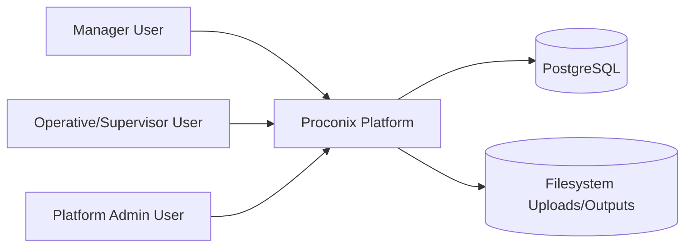
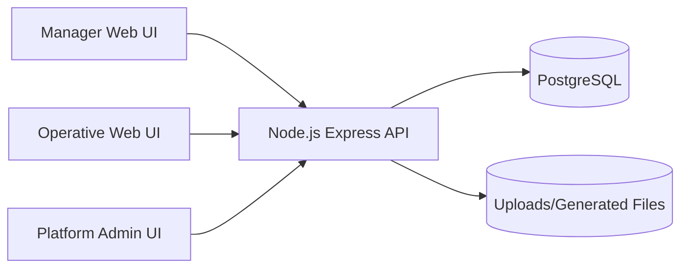
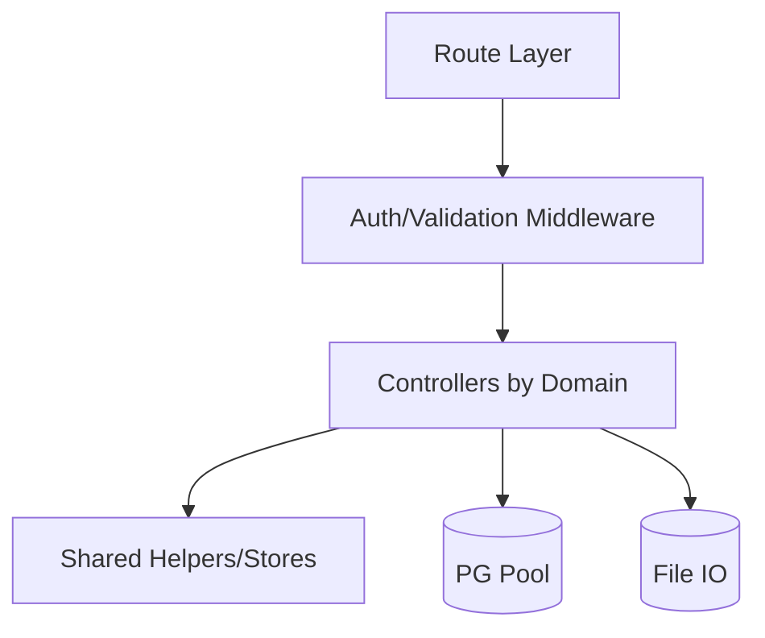
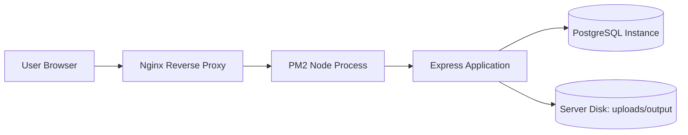

# Document 2: System Architecture Document (SAD) - Full Platform

## 1. Scope and Intent

This document defines the architecture of the full Proconix platform according to practical SAD expectations (aligned with ISO/IEC/IEEE 42010 intent): stakeholders, structure, runtime behavior, constraints, and evolution risks.

Scope includes:
- manager domain,
- operative domain,
- platform admin domain,
- shared backend/API,
- PostgreSQL persistence and filesystem storage.

### 1.1 Architectural Viewpoint

This SAD uses a practical system-viewpoint approach:
- static structure (C4-style views),
- runtime behavior (deep flows),
- design decisions,
- operational concerns,
- risks and mitigations.

## 2. Stakeholders and Concerns

- **Product/Operations:** feature delivery speed, operational visibility.
- **Developers:** maintainability, module boundaries, API consistency.
- **QA:** deterministic flows, predictable error behavior.
- **Platform Admin/Ops:** health metrics, tenant safety, backup/recovery.
- **Security:** strict tenant isolation and role-based access control.

## 3. C4 Architecture Views

### 3.1 C4 Context Diagram

### 3.2 C4 Container Diagram

### 3.3 C4 Component Diagram (Backend Container)

### 3.4 Deployment Diagram (Current Typical VPS)

## 4. Logical Layers

1. **Presentation Layer**
   - static pages and JS modules,
   - manager dashboard with partials + iframe modules.
2. **API/Application Layer**
   - route groups by domain,
   - middleware orchestration.
3. **Domain Layer**
   - business rules in controllers and shared helper logic.
4. **Persistence Layer**
   - PostgreSQL (relational + JSONB),
   - filesystem for binary/runtime artifacts.

## 5. Module Architecture

### 5.1 Identity & Access
- manager auth headers and validation,
- operative token/session auth,
- supervisor project-level constraints,
- platform admin separate auth boundary.

### 5.2 Operational Domains
- projects + assignments,
- operatives management,
- work logs + work hours + uploads/issues,
- planning and QA,
- materials and forecast support,
- unit progress + timeline routing,
- platform admin operations and tenant governance.

## 6. Data Model Overview (Architecture-level)

### 6.1 Primary relational entities
- `companies`, `manager`, `users`
- `projects`, `project_assignments`
- `work_logs`, `work_hours`, `issues`, `uploads`
- `planning_plans`, `planning_plan_tasks`
- QA entities (`qa_templates`, `qa_jobs`, lookups, links)
- materials entities (`material_*`)
- platform admin (`proconix_admin`)

### 6.2 JSONB usage zones
- `work_logs.timesheet_jobs` for structured nested job payloads.
- `unit_progress_state.workspace` for tower/floor/unit/timeline graph.

### 6.3 Tenant isolation zones
- Most entities are tenant-scoped using `company_id`.
- Sensitive access must always derive tenant from authenticated identity.
- No cross-tenant joins should be exposed without strict admin pathway.

## 7. API Structure Overview

### 7.1 URL grouping conventions
- `/api/managers/*`, `/api/operatives/*`, `/api/projects/*`, `/api/worklogs/*`
- `/api/planning/*`, `/api/templates`, `/api/jobs`, `/api/materials/*`
- `/api/unit-progress/*`, `/api/platform-admin/*`, `/api/dashboard/*`

### 7.2 Request/response baseline
- JSON request/response for almost all APIs.
- Consistent `success` and `message` semantics where implemented.
- Role auth via required headers/token depending on route group.

### 7.3 Error handling baseline
- `400` validation,
- `401` auth/session invalid,
- `403` permission denied,
- `404` resource missing,
- `409` conflict/constraint,
- `500` unexpected/internal failure.

### 7.4 Filtering/pagination guideline
- list endpoints should support deterministic filtering/sorting.
- pagination should be standardized for high-volume lists (incremental adoption).

## 8. Deep Runtime Flows

### 8.1 Work Logs Flow (expanded)
1. Operative authenticates and gets valid session/token.
2. Operative opens work log UI and loads context data.
3. Optional files are uploaded through upload endpoint.
4. Client prepares work log payload (including nested JSON fields if present).
5. API route validates auth and payload shape.
6. Controller enforces tenant/project context rules.
7. Work log is persisted to DB.
8. Manager queue endpoint retrieves pending/edited items.
9. Manager approves/rejects/archives/deletes based on review.
10. Destructive delete path attempts filesystem cleanup for referenced files.

### 8.2 QR Access Flow (expanded)
1. QR encodes unit link with `unit_id` query parameter.
2. Router page reads `unit_id`.
3. Router checks manager auth possibility.
4. If not manager, checks supervisor token/session path.
5. Evaluates project access for supervisor where required.
6. Redirects to private timeline when authorized.
7. Redirects to public timeline when not authorized/authenticated.
8. Public page remains read-only.

### 8.3 Demo Provisioning Flow (expanded)
1. Platform admin triggers create-demo endpoint.
2. Backend validates uniqueness constraints (company/email).
3. Transaction starts.
4. Inserts company and head manager.
5. Inserts projects, operatives, assignments.
6. Seeds planning/QA/material/work log baseline where schema exists.
7. Seeds unit progress workspace where table exists.
8. Commits transaction.
9. Returns login-oriented summary payload.
10. Optional email-dispatch endpoint sends credentials info.

## 9. Operational Concerns

### 9.1 Logging strategy
- application-level `console` logging for errors and key operations,
- platform admin panels expose health/log context.

### 9.2 Error handling strategy
- explicit status-code mapping,
- user-facing message payloads in JSON,
- avoid exposing internal stack details to clients.

### 9.3 Background jobs
- currently minimal/no dedicated job queue in core architecture,
- queue depth can be placeholder in health views.

### 9.4 Caching strategy
- no heavy centralized cache layer required today,
- warm-path behavior may rely on process/runtime state and DB/index quality.

### 9.5 File retention strategy
- files live under uploads/output directories,
- cleanup paths should run when records are hard-deleted.

### 9.6 Monitoring metrics
- API health, DB connectivity/latency, request metrics, and admin health panel telemetry.

## 10. Architectural Decisions and Rationale

1. **Monolith with modular routes**
   - optimized for speed of evolution and operational simplicity.
2. **Role-specific middleware**
   - explicit security boundaries and clearer domain permissions.
3. **Hybrid rendering (partials + iframes)**
   - incremental migration without full frontend rewrite.
4. **JSONB in selected domains**
   - reduced migration friction for nested payloads.
5. **Filesystem storage**
   - low operational complexity on current hosting model.

## 11. Risks and Mitigations

1. **Monolith growth risk**
   - risk: slower iteration and scaling friction.
   - mitigation: stricter domain boundaries and progressive extraction strategy.
2. **JSONB overuse risk**
   - risk: schema drift and analytics difficulty.
   - mitigation: validation contracts + normalize high-value domains when needed.
3. **Filesystem dependency risk**
   - risk: disk failure/migration complexity.
   - mitigation: backup policy + future object storage migration path (S3/GCS compatible).
4. **Mixed module loading risk (partials + iframes)**
   - risk: UX inconsistency and session propagation edge cases.
   - mitigation: shared session utility contracts and module QA checklist.

## 12. Non-Functional Requirements

- **Security:** hard tenant isolation and role-aware permissions.
- **Reliability:** transactional integrity for multi-entity writes.
- **Maintainability:** documented API/domain contracts and update discipline.
- **Performance:** responsive module load and predictable list/query response.
- **Operability:** health visibility, metrics, and recoverable storage/database posture.

## 13. Traceability to Package Documents

- Business semantics and policy context: `01-system-overview-business-logic.md`
- Data model and integrity details: `03-database-schema-erd.md`
- API contract baseline: `04-rest-api-openapi.yaml`
- Runtime flow contracts and role matrix: `07-glossary-and-cross-module-flows.md`
- Setup and contributor workflow: `05-developer-onboarding-environment-setup.md`
