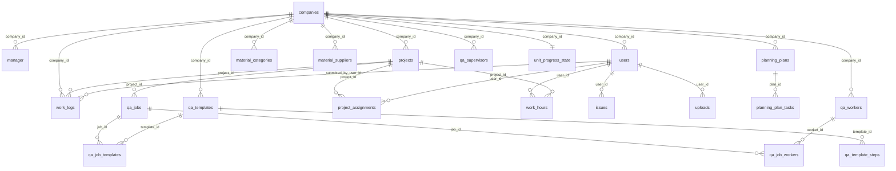

# Document 3: Database Schema & ERD (Production-Oriented)

## 1. Scope

This document describes the current and target-quality data model for full Proconix operations:
- tenant isolation,
- identity and access entities,
- projects/work logs/planning/QA/materials,
- unit progress storage strategy,
- integrity and lifecycle rules.

### 1.1 Documentation posture

- This document is architecture-oriented and intentionally highlights control fields and integrity behavior.
- SQL migrations and live schema remain the source of truth for exact column types/defaults in each environment.

## 2. Detailed ERD (Domain-linked)



## 3. Core Table Definitions (Architecture View)

Note: field lists focus on architecture-critical keys and control fields.

### 3.1 Tenant and Identity

#### `companies`
- PK: `id`
- tenant metadata: `name`, `subscription_plan`, `billing_status`, etc.

#### `manager`
- PK: `id`
- FK-like tenant field: `company_id`
- identity: `email`, `password`, `active`
- role marker: `is_head_manager` and related flags

#### `users` (operative/supervisor space)
- PK: `id`
- tenant field: `company_id`
- project affinity: `project_id` (nullable in some flows)
- identity/status: `email`, `password`, `role`, `active`

#### `proconix_admin`
- PK: `id`
- separate platform-level auth table (not tenant manager).

### 3.2 Projects and Assignment

#### `projects`
- PK: `id`
- tenant field: `company_id`
- project identity and metadata fields.

#### `project_assignments`
- PK: `id`
- links users to projects:
  - `project_id`,
  - `user_id`,
  - role context.

### 3.3 Work Execution

#### `work_logs`
- PK: `id`
- tenant/project/user linkage:
  - `company_id`,
  - `project_id`,
  - `submitted_by_user_id`
- lifecycle:
  - `status`,
  - `archived`,
  - `operative_archived`
- JSONB:
  - `photo_urls`,
  - `timesheet_jobs`.

#### `work_hours`
- PK: `id`
- user/project linkage and clock-in/out timeline (+ optional geo fields).

#### `issues` / `uploads`
- PK: `id`
- `user_id`, optional project context.

#### `operative_task_photos`
- photo evidence for legacy/planning tasks, user-scoped with source/task linkage.

### 3.4 Planning and QA

#### `planning_plans`
- PK: `id`
- tenant: `company_id`.

#### `planning_plan_tasks`
- PK: `id`
- FK: `plan_id`
- optional cross-link: `qa_job_id`
- status, deadline, assignment payload fields.

#### `qa_jobs`
- PK: `id`
- project-scoped, status/cost/floor relations.

#### `qa_templates`, `qa_template_steps`, link tables
- templates and reusable quality steps.

### 3.5 Materials

#### `material_categories`, `material_suppliers`
- tenant-scoped shared resources.

#### `materials`
- project and tenant-scoped stock entity.

#### `material_consumption`
- historical/snapshot basis for forecast logic.

### 3.6 Unit Progress

#### `unit_progress_state`
- PK: `company_id` (1 workspace per tenant).
- JSONB: `workspace` containing towers/floors/units/timeline.
- audit fields: `updated_by_kind`, `updated_by_id`, timestamps.

## 4. Enum and Status Definitions (Canonical Policy)

Implementations may differ by environment/schema version; target normalization:

### 4.1 `work_logs.status`
- `pending`
- `edited`
- `waiting_worker`
- `approved`
- `rejected`

### 4.2 `planning_plan_tasks.status`
- `not_started`
- `in_progress`
- `paused`
- `declined`
- `completed`

### 4.3 `qa_jobs` status domain
- normalized via `qa_job_statuses` lookup (examples):
  - `new`
  - `active`
  - `completed`
  - optional additional lifecycle states per business evolution.

### 4.4 Unit timeline event status (in JSON workspace)
- currently text-driven values (e.g., `In progress`, `Blocked`, `Done`).
- recommendation: normalize into controlled enum contract in app validation layer.
- canonical contract recommendation:
  - API/storage enum: `in_progress`, `blocked`, `done`
  - UI labels: `In progress`, `Blocked`, `Done`

## 5. JSON Contracts (Required)

### 5.1 `work_logs.photo_urls`

```json
[
  "/uploads/worklogs/file-1.jpg",
  "/uploads/worklogs/file-2.jpg"
]
```

### 5.2 `work_logs.timesheet_jobs` (representative shape)

```json
[
  {
    "type": "qa_price_work",
    "entries": [
      {
        "qaJobId": 1001,
        "jobNumber": "QA-001",
        "stepQuantities": {
          "templateA:step1": { "m2": 12, "linear": 0, "units": 0 }
        },
        "stepPhotoUrls": {
          "templateA:step1": ["/uploads/worklogs/step-1.jpg"]
        }
      }
    ]
  }
]
```

### 5.3 `unit_progress_state.workspace` (representative shape)

```json
{
  "towers": [{ "id": "A", "name": "Tower A" }],
  "floors": [{ "id": "A-2", "tower": "A", "number": 2, "name": "Floor 2" }],
  "units": [
    {
      "id": 202,
      "name": "Unit 202",
      "tower": "A",
      "floor": 2,
      "project_id": 12,
      "timeline": [
        {
          "stage": "Electrical First Fix",
          "status": "In progress",
          "reason": "",
          "comment": "Cable path prepared.",
          "user": "Supervisor Name",
          "date": "2026-04-26T10:00:00.000Z",
          "photos": [
            { "name": "e1.jpg", "src": "data:image/jpeg;base64,..." }
          ]
        }
      ]
    }
  ]
}
```

## 6. Multi-Tenant Clarity and Auth Data Boundaries

### 6.1 Tenant boundary principle
- `company_id` is the primary tenant separator.
- platform admin table is isolated from tenant user tables.

### 6.2 Identity vs role clarity
- `manager` and `users` are currently distinct operational entities (not a single role table).
- supervisor behavior is derived via operative context + project scope checks.

### 6.3 Sessions/tokens
- manager and platform admin rely on header-validated session payloads.
- operative/supervisor flows use operative token/session channel.
- DB session tables are not primary architecture entities in current model (session state mostly application-side).

## 7. QA <-> Planning <-> Work Logs Cross-Link Rules

### 7.1 Ownership expectations
- planning task can reference QA job via `qa_job_id` (one task -> zero/one linked QA job by current convention).
- one QA job may map to one planning task in sync flows (policy-level expectation; enforce in service logic).

### 7.2 Sync behavior intent
- QA job create/update/delete should keep planning linkage consistent where integration is enabled.
- reject/decline semantics must be explicit at service layer (status transitions, not silent deletes).

## 8. Integrity and Cascading Rules

Define and enforce domain-safe delete behavior:

### 8.1 Recommended policy matrix
- tenant delete (admin): controlled hard-delete workflow with ordered cleanup.
- project delete/deactivate: prefer restrict/deactivate path unless full cascade is deliberate.
- work log hard-delete: DB row remove + filesystem cleanup.
- materials domain: soft-delete where supported.

### 8.2 FK action guidance
- use `ON DELETE RESTRICT` where accidental destructive cascades are high risk.
- use `ON DELETE CASCADE` only for strict child-dependent records.
- use `ON DELETE SET NULL` for optional historical links where record retention is required.

## 9. `unit_progress_state` JSONB Risk Statement and Migration Plan

### 9.1 Accepted current risk
- large JSONB rewrites on timeline append can create write amplification.
- indexing and analytics across nested arrays are limited.
- schema drift risk if validation contracts are weak.

### 9.2 Why currently accepted
- high iteration speed for nested hierarchy model,
- reduced migration overhead during feature evolution.

### 9.3 Planned migration path (when thresholds hit)
1. introduce relational `units` and `unit_progress_entries` tables.
2. extract timeline photos to `unit_progress_photos`.
3. backfill from JSONB to relational model in controlled migration.
4. keep compatibility read adapter during transition.
5. deprecate large JSONB writes after cutover.

## 10. Indexing Strategy (Query-driven)

- tenant indexes on all tenant-bound operational tables (`company_id`).
- queue/list indexes:
  - `work_logs(company_id, status, submitted_at)`
  - `planning_plan_tasks(plan_id, status, deadline)`
  - `project_assignments(project_id, user_id)`
- unit progress:
  - PK on `company_id`
  - recency index on `updated_at`
- materials:
  - project/company filter indexes and snapshot date indexes.

## 11. Change Control Guidance

- Any new status field must be added to:
  1) DB schema/migration,
  2) API validation layer,
  3) this document status section,
  4) OpenAPI examples when applicable.
- Any new JSONB payload contract must include:
  - representative example,
  - validation notes,
  - migration impact note.
