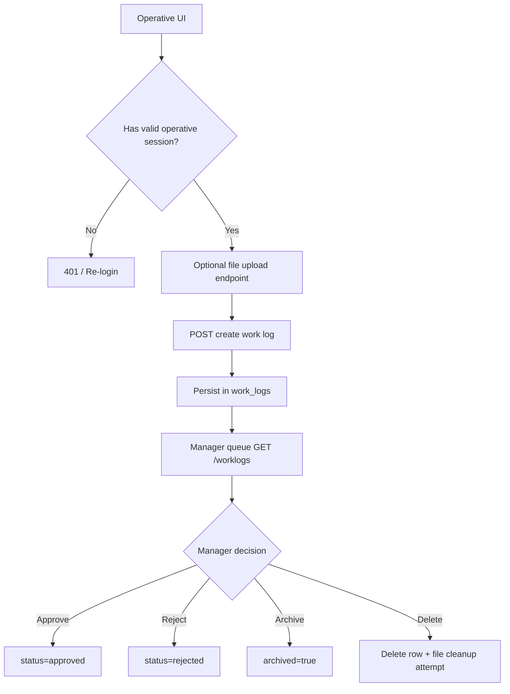
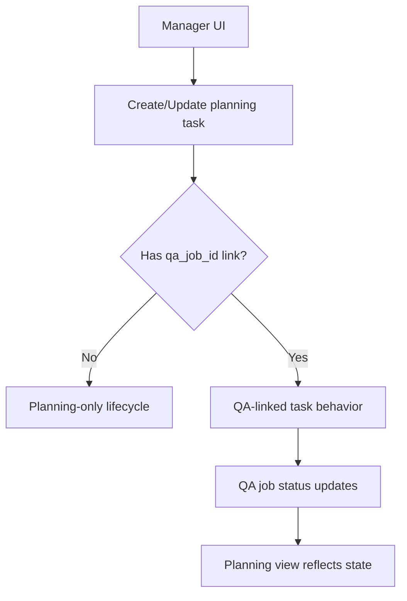
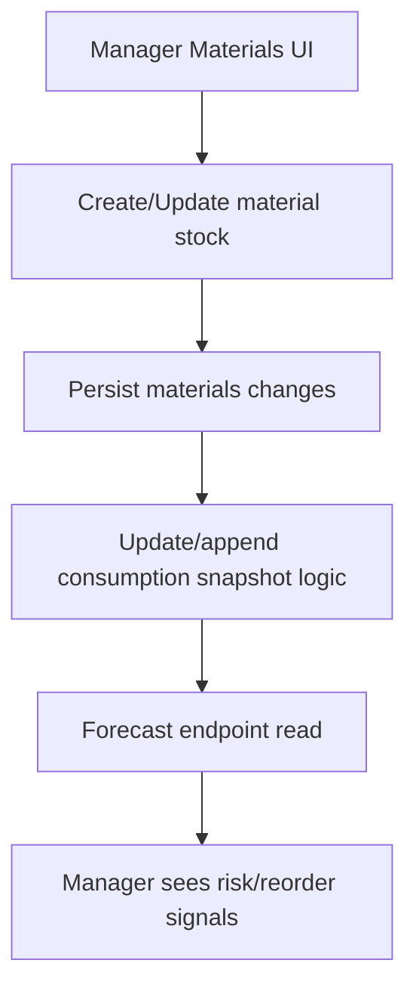
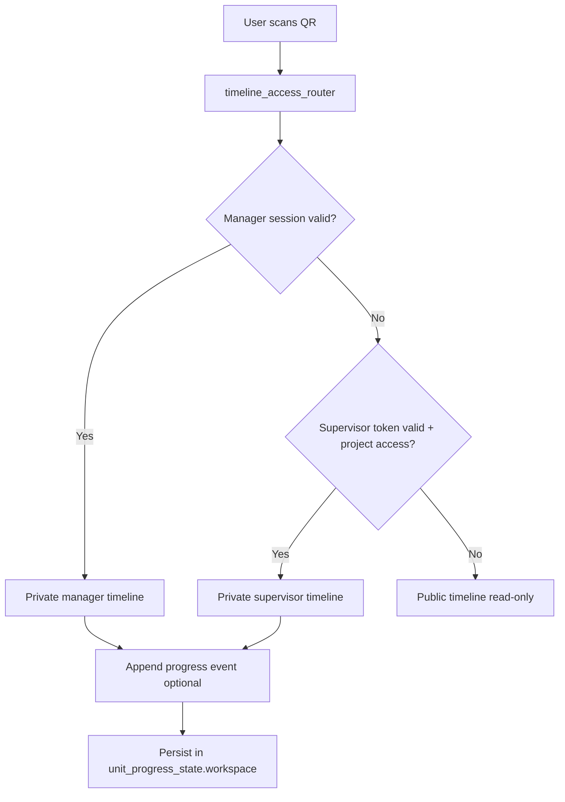
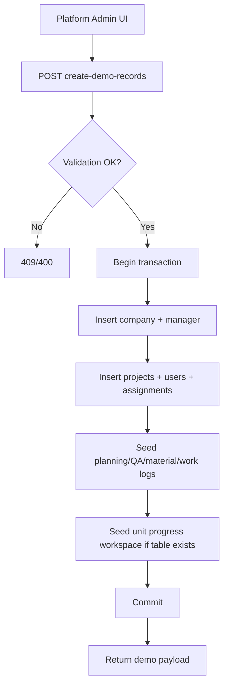

# Document 7: Glossary and Cross-Module Flows (Full Operational Contract)

## 1. Purpose

This document defines:
- shared business vocabulary,
- cross-module runtime flows,
- flow contracts (API entry, validations, DB writes, side effects),
- role permissions,
- edge-case behavior.

It is intended for new developers and QA engineers to reduce ambiguity.

---

## 2. Extended Glossary (with DB and examples)

### 2.1 Tenant
- **Definition:** one company data boundary in platform context.
- **Example:** Company A cannot access Company B projects/work logs.
- **DB anchor:** `companies.id`, propagated via `company_id` in tenant tables.
- **Related terms:** manager, users, projects.

### 2.2 Manager
- **Definition:** company-level operational controller.
- **Example:** approves/rejects work logs, manages planning and QA.
- **DB anchor:** `manager` table.
- **Difference vs platform admin:** manager acts inside one tenant only.

### 2.3 Operative
- **Definition:** site execution user (worker/supervisor flavor).
- **Example:** submits work logs, task updates, photos, issues.
- **DB anchor:** `users` table.
- **Note:** supervisor capabilities are constrained by project linkage and route policy.

### 2.4 Work Log
- **Definition:** operative-submitted record of work performed.
- **Example:** “Installed ceiling framing in Block B, 85 units”.
- **DB anchor:** `work_logs`.
- **Related JSON fields:** `photo_urls`, `timesheet_jobs`.
- **Difference vs issue:** work log is execution evidence; issue is incident/problem report.

### 2.5 Issue
- **Definition:** problem report raised from site.
- **Example:** “Damaged delivery pallet, photos attached”.
- **DB anchor:** `issues`.
- **Difference vs work log:** issue tracks defects/blockers, not production quantity.

### 2.6 Planning Task
- **Definition:** scheduled execution item for assignment and deadline tracking.
- **DB anchor:** `planning_plan_tasks`.
- **Statuses:** `not_started`, `in_progress`, `paused`, `declined`, `completed`.
- **Relation:** may link QA via `qa_job_id`.

### 2.7 QA Job
- **Definition:** quality-control job tied to project scope and QA templates.
- **DB anchor:** `qa_jobs` + QA link tables.
- **Relation:** can be reflected in planning state depending on sync logic.

### 2.8 Material
- **Definition:** project stock entity used for consumption/forecast.
- **DB anchor:** `materials`, `material_consumption`.
- **Example:** gypsum board, fixings, insulation consumables.

### 2.9 Unit Timeline Event
- **Definition:** append-only progress update for one unit in Unit Progress.
- **DB anchor:** `unit_progress_state.workspace` JSONB.
- **Fields:** stage, status, reason, comment, user, date, photos.

### 2.10 Public Timeline
- **Definition:** read-only timeline view accessible without private session.
- **Entry point:** QR router redirection logic.
- **Mutation:** not allowed.

### 2.11 Private Timeline
- **Definition:** authenticated timeline with add-progress capability.
- **Access:** manager or authorized supervisor only.

### 2.12 Demo Tenant
- **Definition:** full seeded tenant generated by platform admin for onboarding/sales/testing.
- **DB impact:** multi-domain inserts across company/project/users/work logs/planning/QA/materials/unit progress.

---

## 3. Role Permissions Matrix

| Action | Manager | Operative/Supervisor | Platform Admin |
|---|---|---|---|
| Create project | Yes | No | No |
| Assign users to project | Yes | No | No |
| Create work log | No | Yes | No |
| Approve/reject work log | Yes | No | No |
| Delete work log (hard-delete flow) | Yes | No | No |
| Manage planning tasks | Yes | No | No |
| Manage QA templates/jobs | Yes | No | No |
| Manage materials | Yes | No | No |
| Add private unit progress | Yes | Yes (project-scoped) | No |
| View public timeline | Yes | Yes | Yes |
| Create demo tenant | No | No | Yes |
| Manage tenant billing/system-health | No | No | Yes |

---

## 4. Cross-Module Flows (Detailed)

## 4.1 Flow A - Operative Work Log -> Manager Decision

### Diagram



### Flow Contract

- **API entry**
  - Operative: `POST /api/operatives/work-log`
  - Manager review: `POST /api/worklogs/:id/approve|reject|archive`, `DELETE /api/worklogs/:id`
- **Validations**
  - operative session/token valid,
  - tenant/project context valid,
  - payload shape validation (including JSON fields where present).
- **DB mutations**
  - insert/update in `work_logs`,
  - optional references from uploaded file paths.
- **Side effects**
  - manager queue visibility,
  - delete flow triggers storage cleanup attempt.
- **Possible statuses**
  - `pending`, `edited`, `waiting_worker`, `approved`, `rejected`, plus archive flags.
- **Errors**
  - `400`, `401`, `403`, `404`, `500`.

---

## 4.2 Flow B - Planning <-> QA Coordination

### Diagram



### Flow Contract

- **API entry**
  - planning: `/api/planning/*`
  - QA: `/api/templates`, `/api/jobs*`
- **DB mutations**
  - `planning_plans`, `planning_plan_tasks`,
  - `qa_jobs` and QA link tables.
- **Cross-link field**
  - `planning_plan_tasks.qa_job_id`.
- **Validation**
  - manager auth,
  - project/company scope.
- **Errors**
  - invalid linkage, missing records, tenant mismatch.

---

## 4.3 Flow C - Materials Updates -> Forecast Visibility

### Diagram



### Flow Contract

- **API entry**
  - `/api/materials/*`, `/api/materials/forecast`
- **DB mutations**
  - `materials`,
  - `material_consumption` (where snapshot logic is enabled by flow).
- **Validation**
  - manager auth,
  - tenant/project ownership checks.
- **Errors**
  - invalid quantities,
  - unauthorized project access.

---

## 4.4 Flow D - Unit Progress + QR Routing

### Diagram



### Flow Contract

- **API entry**
  - workspace: `GET/PUT /api/unit-progress/workspace` (+ supervisor variant),
  - timelines: public/private endpoints in `/api/unit-progress/*`.
- **DB mutations**
  - `unit_progress_state.workspace` JSONB update.
- **Validation**
  - required fields for progress event,
  - blocked requires reason,
  - photo max 5.
- **Errors**
  - invalid unit id,
  - unauthorized access,
  - missing table/schema mismatch.

### JSONB Unit Progress Contract (summary)

```json
{
  "towers": [],
  "floors": [],
  "units": [
    {
      "id": 202,
      "project_id": 12,
      "timeline": [
        {
          "stage": "Electrical First Fix",
          "status": "In progress",
          "comment": "Cable path prepared",
          "photos": [{ "name": "p1.jpg", "src": "data:image/jpeg;base64,..." }]
        }
      ]
    }
  ]
}
```

**Status normalization rule:** use canonical API/storage enum values `in_progress`, `blocked`, `done`; UI may render labels as `In progress`, `Blocked`, `Done`.

---

## 4.5 Flow E - Platform Admin Demo Provisioning

### Diagram



### Flow Contract

- **API entry**
  - `POST /api/platform-admin/create-demo-records`
  - optional `POST /api/platform-admin/send-demo-login-email`
- **DB mutations**
  - cross-domain tenant seed across key tables.
- **Validation**
  - duplicate company/email checks,
  - payload constraints.
- **Errors**
  - transaction rollback on failure.

---

## 5. Edge Cases and Expected Behavior

1. **Operative without project assignment**
   - expected: deny mutation in project-scoped flows (`403` or business-safe rejection).
2. **Uploaded file reference missing on disk**
   - expected: fail gracefully in preview/download; keep DB consistency; log cleanup miss.
3. **Planning deadline already expired**
   - expected: task visibility remains; status update rules still explicit.
4. **Linked QA job deleted**
   - expected: planning linkage must be handled safely (clear/mark/break relation by policy).
5. **Unit id invalid in QR path**
   - expected: safe error/redirect, no private data leak.
6. **Cross-tenant identifier spoof attempt**
   - expected: authorization fails by tenant-derived identity checks.

---

## 6. Document Cross-References

- For architecture decisions and C4 views: see `02-system-architecture-sad.md`.
- For schema detail and JSON contracts: see `03-database-schema-erd.md`.
- For API contract and endpoint definitions: see `04-rest-api-openapi.yaml`.
- For user-level operation sequence: see `06-business-operations-user-manual.md`.
- For business policy framing: see `01-system-overview-business-logic.md`.

---

## 7. Data Integrity Principles Across Modules

1. Enforce tenant scope (`company_id`) at all write/read boundaries.
2. Keep role boundaries explicit (manager vs operative/supervisor vs platform admin).
3. Preserve append-only behavior for unit timeline events.
4. Keep file lifecycle aligned with DB lifecycle in destructive operations.
5. Use explicit status transitions rather than implicit side-effects.

---

## 8. Flow Contracts Table (Code Review + QA Ready)

| Flow | Initiator | API Entry Points | Core Validations | DB Mutations | Side Effects | Possible Statuses | Common Errors |
|---|---|---|---|---|---|---|---|
| Work Log Submission | Operative | `POST /api/operatives/work-log`, optional `POST /api/operatives/work-log/upload` | operative auth valid; project/tenant scope valid; payload shape valid | `work_logs` insert/update, optional file path refs | appears in manager queue; later reviewable in dashboard | `pending`, `edited`, `waiting_worker` (then manager transitions) | `400` invalid body, `401` invalid session, `403` unauthorized scope, `500` server |
| Work Log Decision | Manager | `POST /api/worklogs/:id/approve`, `POST /api/worklogs/:id/reject`, `POST /api/worklogs/:id/archive`, `DELETE /api/worklogs/:id` | manager auth valid; same tenant record; id exists | `work_logs` status/archive/delete updates | optional file cleanup on hard delete; queue changes instantly | `approved`, `rejected`, archived flags | `401`, `403`, `404`, `409`, `500` |
| Planning Task Lifecycle | Manager | `/api/planning/list`, `POST /api/planning/plan-tasks`, `PATCH /api/planning/plan-tasks/:id`, `DELETE /api/planning/plan-tasks/:id` | manager auth; company scope; date/status validation | `planning_plans`, `planning_plan_tasks` | task visibility updates in manager UI and operative task feeds | `not_started`, `in_progress`, `paused`, `declined`, `completed` | `400`, `401`, `403`, `404`, `500` |
| QA Job Lifecycle | Manager | `/api/templates*`, `/api/jobs*` | manager auth; project belongs to tenant; QA payload validity | `qa_templates`, `qa_template_steps`, `qa_jobs`, link tables | planning linkage update path where enabled | lookup-driven statuses (`new`, `active`, `completed`, etc.) | `400`, `401`, `403`, `404`, `500` |
| Planning ↔ QA Sync | Manager (indirect via planning/QA actions) | planning and QA endpoints above | linked record exists; valid tenant/project; sync rule allowed | `planning_plan_tasks.qa_job_id` updates; QA/Planning records | cross-module status coherence | planning + QA statuses combined | `404` missing link, `409` conflict, `500` sync error |
| Materials Update + Forecast | Manager | `/api/materials*`, `/api/materials/forecast` | manager auth; tenant/project ownership; quantity sanity checks | `materials`, optional `material_consumption` snapshots | dashboard stock signals and forecast warnings | material status domain (`normal`/`low`/`out`) | `400`, `401`, `403`, `404`, `500` |
| Unit Progress Workspace Save | Manager / Supervisor | `PUT /api/unit-progress/workspace` or supervisor variant | role auth valid; workspace object shape; tenant scope | `unit_progress_state.workspace` upsert | unit views rehydrate with latest structure | N/A (workspace write) | `400`, `401`, `403`, `500` |
| Unit Timeline Append | Manager / Supervisor | `POST /api/unit-progress/private-timeline/.../:unitId/progress` | required stage/status/comment; blocked→reason; max 5 photos; project access (supervisor) | append event inside `unit_progress_state.workspace` | timeline cards update; available to snapshot generation | canonical statuses: `in_progress`, `blocked`, `done` (UI labels may be title-case) | `400`, `401`, `403`, `404`, `500` |
| QR Router Decision | Anonymous/Authenticated scanner | `timeline_access_router.html` + unit-progress read endpoints | parse `unit_id`; evaluate manager/supervisor auth; supervisor project check | no direct write (read/routing only) | redirect to private or public timeline | private path vs public path | invalid unit, unauthorized private access, missing unit |
| Demo Tenant Provisioning | Platform Admin | `POST /api/platform-admin/create-demo-records`, optional `POST /api/platform-admin/send-demo-login-email` | platform admin auth; duplicate checks; mandatory fields | transactionally seeds `companies`, `manager`, `users`, `projects`, planning, QA, materials, `work_logs`, `unit_progress_state` (if present) | ready-to-use demo tenant; optional outbound email | success/rollback outcome | `400`, `401`, `409`, `500` |

### Contract Usage Notes

- Use this table as the minimum review gate before merging changes touching multi-module behavior.
- For each changed flow in a PR, verify: auth boundary, tenant scope, DB mutation integrity, and error semantics.
- If a PR changes statuses or payload shape, update this table and `04-rest-api-openapi.yaml` in the same change set.

## 9. QA Test-Case Matrix (Derived 1:1 from Flow Contracts)

| TC ID | Flow | Scenario | Preconditions | Expected Result |
|---|---|---|---|---|
| TC-FLOW-A-01 | Work Log Submission | Operative submits valid work log | Operative assigned to project | API accepts submit; `work_logs` row created within tenant scope |
| TC-FLOW-A-02 | Work Log Decision | Manager approves submitted log | Submitted log exists in same tenant | Status transitions to `approved`; queue refreshes |
| TC-FLOW-A-03 | Work Log Decision | Manager rejects without reason | Submitted log exists | Validation error, no status mutation persisted |
| TC-FLOW-B-01 | Planning ↔ QA Sync | Planning task links QA job | Manager authenticated, task exists | Link persisted and exposed in planning/QA views |
| TC-FLOW-B-02 | Planning ↔ QA Sync | Reject path keeps task non-complete | QA job linked and in rejectable state | Task remains not completed; reject context visible |
| TC-FLOW-C-01 | Materials Update + Forecast | Material consumption decreases stock | Stock exists and qty is valid | Stock decremented and forecast warning state recalculated |
| TC-FLOW-C-02 | Materials Update + Forecast | Invalid negative stock transition | Insufficient stock for requested deduction | Request rejected with validation/conflict response |
| TC-FLOW-D-01 | Unit Timeline Append | Authorized manager appends event | Manager authenticated in tenant | Event appended; appears in private and public timeline reads |
| TC-FLOW-D-02 | Unit Timeline Append | Append with 6 photos | Valid auth/session | Request rejected by max-photo validation rule |
| TC-FLOW-D-03 | QR Router Decision | Anonymous user scans QR | No active private session | Router sends user to public read-only timeline |
| TC-FLOW-E-01 | Demo Tenant Provisioning | Create demo records | Platform admin authenticated | Demo tenant seeded across core modules transactionally |
| TC-FLOW-E-02 | Demo Tenant Provisioning | Duplicate-protected create | Existing conflicting demo/company identity | API returns conflict without partial tenant writes |
